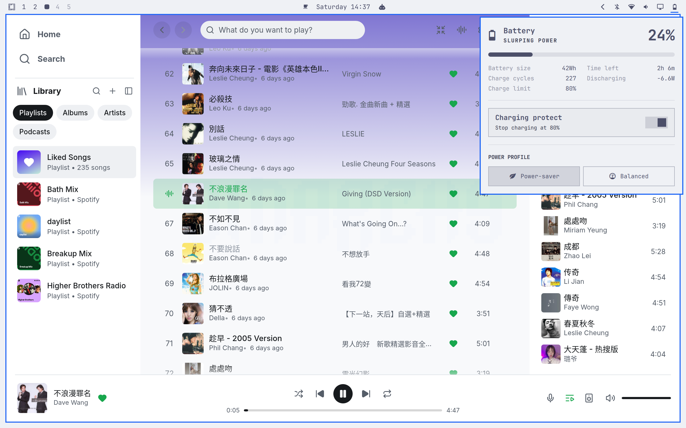

# Charging Protect for Omarchy

A small Omarchy power-panel replacement for Apple Silicon systems running an Asahi kernel.
It adds a **Charging protect** switch to the battery panel:

- **On**: enables the kernel/UPower charging threshold at **80%**.
- **Off**: disables charging protection and restores the normal **100%** limit.

The panel also displays the current charge limit.



## Requirements

- Omarchy 4 / Quickshell.
- An Asahi-powered Apple Silicon system exposing `macsmc-battery`.
- UPower with `org.freedesktop.UPower.Device.EnableChargeThreshold`.
- A desktop session with an active polkit agent.

The plugin is intended for Apple Silicon Asahi systems. On unsupported hardware the switch remains unavailable and the original power panel behavior should be preferred.

## Install

Install and enable it with Omarchy's plugin manager:

```bash
omarchy plugin add https://github.com/zephyr-cheung/omarchy-charging-protect --enable --yes
```

Because this plugin declares `omarchy.clonedFrom: "omarchy.power"`, enabling it replaces the built-in power widget while preserving the original slot and IPC target.

If it does not land in the desired bar position, place it manually:

```bash
omarchy bar move io.github.zephyr-cheung.charging-protect --section right
```

Open the battery icon, then toggle **Charging protect**.

## Remove

```bash
omarchy plugin remove io.github.zephyr-cheung.charging-protect --yes
```

Removing the plugin restores the built-in `omarchy.power` widget. Removing the plugin does not change the current hardware threshold; turn the switch off first if you want to restore the 100% limit before uninstalling.

## How it works

The plugin reads the current threshold from:

```text
/sys/class/power_supply/macsmc-battery/charge_control_end_threshold
```

It changes protection through UPower's system D-Bus method:

```text
org.freedesktop.UPower.Device.EnableChargeThreshold(bool)
```

The Asahi/UPower integration stores the selected threshold persistently through its udev/systemd path unit. The plugin does not write system files, install packages, run a daemon, or ship an install script.

The 80% value is intentionally fixed. Turning protection off asks UPower to disable the threshold, which restores the normal 100% behavior on the Asahi driver.

## Security and privacy

- No network requests.
- No credentials, cookies, or personal data.
- No background service.
- No direct root shell or arbitrary command input.
- The only privileged operation is UPower's own polkit-protected charging-threshold action.
- The plugin runs as unsandboxed QML inside `omarchy-shell`, as all Omarchy shell plugins do.

This project is not a security review of Omarchy, UPower, or the kernel.

## License

MIT. See [LICENSE](LICENSE).
